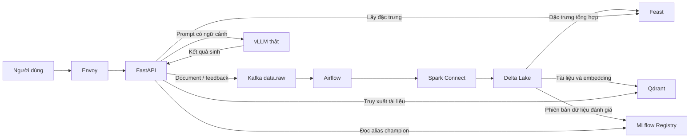
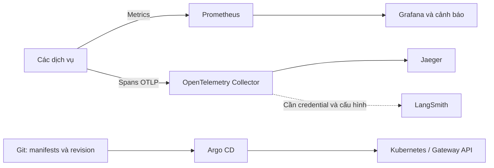

# Kiến trúc và trách nhiệm — bài nộp Day 28

Người nộp: Nguyễn Minh Phương — 2A202601947. Hình thức: cá nhân, có hỗ trợ AI
trong triển khai, kiểm thử và soạn báo cáo. Sơ đồ mô tả thiết kế của kho mã;
kết quả xác minh từng thành phần được ghi riêng trong `REPORT.md`.

## Điểm kết nối và trách nhiệm cá nhân

| Phần phụ trách | Điểm kết nối | Công việc cần giải thích |
|---|---|---|
| Ingestion và điều phối | IP01, IP02 | Contract sự kiện, Kafka headers, retry, DLQ và Airflow run |
| Dữ liệu và mô hình | IP03, IP04, IP06 | Chọn bản tin mới nhất, Delta MERGE, Feast features, MLflow alias |
| Truy xuất và phục vụ | IP05, IP07 | ID vector ổn định, grounding và nhận diện máy chủ vLLM thật |
| Nền tảng và quan sát | IP08, IP09, IP10 | Gateway, readiness, metrics, trace và manifest triển khai |
| Trình bày | Toàn bộ | Đối chiếu báo cáo, bằng chứng thực tế và các phần chưa xác minh |

## Vì sao cần cả hai bước chống trùng?

`dedupe_latest` chọn một sự kiện cho mỗi `idempotency_key` **trong lô đầu vào**.
Delta `MERGE` đối chiếu các khóa đó với **bảng đang lưu** để cập nhật hoặc thêm.
Hai bước phối hợp để lần phát lại cùng lô không tạo thêm hàng. Hàm Python không
tự ghi Delta và kiểm thử hàm không thay thế bằng chứng phát lại trên hệ thống thật.

Tham khảo [sơ đồ tổng thể gốc](images/lab28-architecture-overview.png),
[ma trận kết nối](../contracts/integration-matrix.yaml) và
[báo cáo bài nộp](../REPORT.md).
